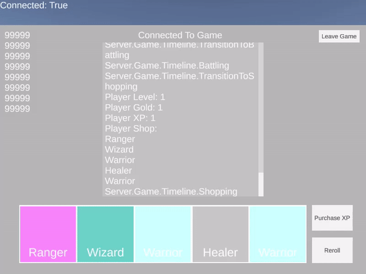

# AutoChess

This is an attempt at creating a server authoritative auto chess game.

Inspired by Dota Underlords and Teamfight Tactics.

## Client

The client is done with Unity

## Server

The server is done using a custom game engine. The networking is done using Lidgren.

## Showcase

### Current

Client is able to:

	- Connect to game server running
	- Reroll
	- Buy Units
	- Buy XP
	- Level up
	- Sell Units
  	- Show purchased units on a bench
	- Shows current gold
	- Shows other players connected to the server
	- Shows the current unit selected

_* Gold looks like it isn't working correctly because certain actions don't have costs associated with them for the showcase_

### Old

This section contains old showcases of the client.

`February 24th, 2021`

Client is able to:

	- Connect to game server running on localhost
	- Reroll
	- Buy Units
	- Buy XP
_*Gold is functioning but for the showcase the costs of everything was set to 0_
